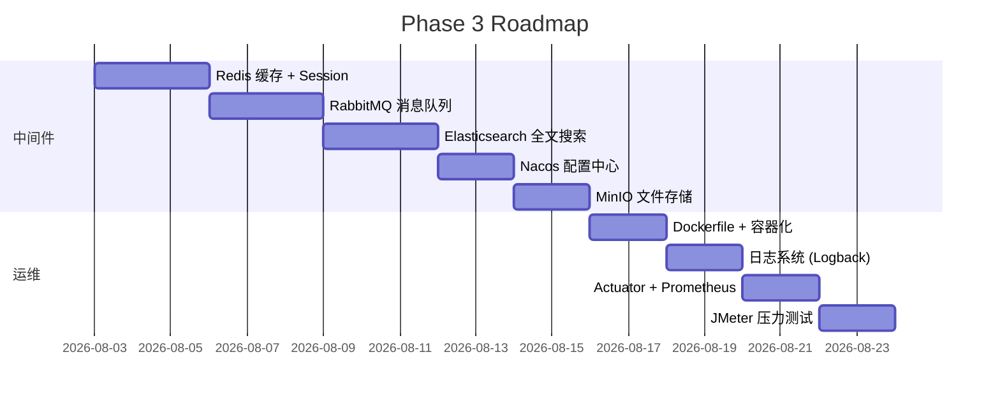

# Phase 2 复盘 — Industrial AI Hub V1 完整交付

> 阶段：第 4-6 周（Day 22 ~ Day 42）| 日期：2026-07-11 ~ 2026-08-02 | 作者：hula0710 + Codex

---

## 一、阶段目标回顾

| 目标 | 状态 | 说明 |
|------|:---:|------|
| JWT 认证 + BCrypt 加密 | ✅ | Day 23 完成，Claims 含 roles |
| RBAC 三级权限模型 | ✅ | Day 24 完成，ADMIN/OPERATOR/VIEWER + @RequireRole |
| 设备 CRUD + 逻辑删除 + 分页搜索 | ✅ | 5 端点，keyword/type/status 复合搜索 |
| 设备数据上报 + 报警规则引擎 | ✅ | 8 条规则，4 种数据类型 |
| AOP 操作日志 | ✅ | @OperationLog 注解驱动，自动记录 |
| Vue3 前端 4 页面 | ✅ | 设备列表/详情/报警/日志 + ECharts 图表 |
| 单元测试 | ✅ | 75 tests，7/7 Service 覆盖 |
| Knife4j 接口文档 | ✅ | 26 端点中文注解 |
| Redis Stack + MySQL 主从 | ✅ | Infrastructure Baseline V1 |
| 性能优化 + 限流 | ✅ | Guava RateLimiter 50 req/s |

---

## 二、交付物清单

### 2.1 后端模块

| 模块 | 类数 | 文件 | 说明 |
|------|:---:|------|------|
| Controller | 6 | Auth/User/Device/DeviceData/Alarm/OperationLog | 26 端点 |
| Service | 7 | Auth/User/Device/DeviceData/Alarm/AlarmDetector/OperationLog | 全部有单测 |
| Mapper | 7 | User/Role/UserRole/Device/DeviceData/Alarm/OperationLog | MyBatis 注解 |
| Entity | 7 | User/Role/UserRole/Device/DeviceData/Alarm/OperationLog | 手动 getter/setter |
| DTO | 11 | ApiResponse/LoginReq/RegisterReq/DeviceDTO/DeviceVO/UserVO/UserUpdateDTO/DataReportReq/DeviceDataStats/AlarmVO/OperationLogVO | 含校验注解 |
| Security | 3 | JwtAuthFilter/AuthInterceptor/RateLimitInterceptor | 过滤器链 |
| Config | 4 | WebMvcConfig/CorsConfig/Knife4jConfig/SecurityConfig | Spring 配置 |
| Enums | 2 | ErrorCode/RoleEnum | 错误码 + 角色 |
| Annotation | 2 | @RequireRole/@OperationLog | 权限 + 日志 |
| Exception | 2 | BusinessException/GlobalExceptionHandler | 4 种异常类型 |
| Rule | 3 | AlarmRule/Operator/AlarmRuleConfig | 8 条报警规则 |
| Util | 1 | JwtUtils | JJWT 0.12.6 |
| XML Mapper | 2 | DeviceMapper.xml/DeviceDataMapper.xml | 动态 SQL |

**后端合计：55 files (main) + 7 files (test) = 62 Java + 2 XML**

### 2.2 前端模块

| 模块 | 文件 | 说明 |
|------|:---:|------|
| 页面 | 4 | DeviceList/Detail/AlarmList/OperationLogList |
| 组件 | 3 | ToastMessage/LoadingSpinner/EmptyState |
| API 层 | 1 | Axios 封装 + 拦截器 |
| 路由 | 1 | Vue Router hash mode |

### 2.3 基础设施

| 服务 | 版本 | 文件/配置 |
|------|------|------|
| MySQL 主从 | 8.4 | `mysql/` + `compose.yml` |
| Redis Stack | 7.4.0-v1 | `redis/` + AOF+RDB |
| RabbitMQ | 4.0 | `compose.yml` |
| Nacos | 2.4.3 | `compose.yml` |
| Elasticsearch | 8.17.0 | `compose.yml` |
| MinIO | latest | `compose.yml` |

### 2.4 文档

| 文档 | 路径 |
|------|------|
| AGENTS.md | 项目根目录 AI 入口 |
| README.md | 项目完整介绍 |
| 路线图 | `backend/DAILY_ROADMAP.md` (112 天) |
| 应用架构 | `docs/Architecture/Application-Architecture.md` |
| 系统架构图 | `docs/Architecture/System-Architecture.md` |
| 数据库 ER 图 | `docs/Architecture/Database-ER.md` |
| API 清单 | `docs/Architecture/API-Reference.md` |
| 基础设施基线 | `docs/Architecture/Infrastructure-Baseline.md` |
| ADR 决策记录 | `docs/decision-log/0001~0011` |
| SQL 审计 | `docs/reports/SQL-Audit-Report.md` |
| 架构审计 | `docs/reports/Architecture-Consistency-Report.md` |

---

## 三、代码质量指标

| 指标 | 数值 | 评级 |
|------|:---:|:---:|
| 单元测试 | 75 (7/7 Service) | ✅ |
| @Autowired 字段注入 | 0 | ✅ |
| System.out.println | 0 | ✅ |
| printStackTrace | 0 | ✅ |
| TODO/FIXME 残留 | 0 | ✅ |
| 构造器注入覆盖率 | 100% | ✅ |
| API 响应格式统一 | 100% ApiResponse<T> | ✅ |
| 异常处理覆盖 | 4 种类型 | ✅ |
| 逻辑删除 | user + device 双表 | ✅ |
| 参数校验 | 5/5 Controller | ✅ |
| SQL 注入防护 | MyBatis #{} 参数化 | ✅ |
| 密码加密 | BCrypt | ✅ |
| JWT 密钥 | 环境变量（非硬编码） | ✅ |

---

## 四、V1 技术债务清单

### P1（Phase 3 第一周处理）

| # | 问题 | 影响 |
|:---:|------|------|
| 1 | JwtUtils 是 static 工具类，无法通过配置调整 | 扩展性差 |
| 2 | UserService.listAll() 返回 User 实体含密码字段 | 安全隐患 |
| 3 | 注册无频率限制 | 可被批量刷注册 |
| 4 | 无 Token 刷新/登出机制 | 24h 过期后必须重新登录 |
| 5 | 缺少全局日志 traceId | 排障困难 |

### P2（Phase 3 渐进处理）

| # | 问题 | 影响 |
|:---:|------|------|
| 6 | Entity 全部手写 getter/setter（77 行样板代码） | 可引入 Lombok |
| 7 | 状态字段全是魔法数字（0/1/2） | 可读性差 |
| 8 | `user` 表名是 MySQL 保留字 | 潜在解析风险 |
| 9 | 无外键约束 | 可能孤儿数据 |
| 10 | 缺少 Swagger 示例值注解 | API 文档不够丰富 |
| 11 | compose.yml 无 profiles 分组 | 全量启动资源大 |

### P3（后续迭代）

| # | 问题 | 影响 |
|:---:|------|------|
| 12 | 无应用层 Dockerfile | Spring Boot 无法容器化 |
| 13 | ECharts bundle 687KB（无分包） | 首屏加载慢 |
| 14 | 报警规则硬编码在 AlarmRuleConfig | 不可动态调整 |
| 15 | DeviceData 时间范围查询无分页 | 大数据量内存溢出风险 |

---

## 五、关键架构决策

| ADR | 决策 | 理由 |
|-----|------|------|
| 0001 | JDK 25 LTS | Oracle LTS 节奏 17→21→25 |
| 0002 | MyBatis 注解 (简单 SQL) + XML (动态 SQL) | 简单查询保持轻量，动态 SQL 可维护 |
| 0003 | 不引入 Lombok（Phase 2） | 避免学习阶段隐藏细节 |
| 0004 | 手动 PageInfo 转换而非直接返回 Entity | 防止 password/isDeleted 泄漏 |
| 0005 | JWT Claims 含 roles（Day 24 优化） | 减少 RBAC 查库次数 |
| 0006 | 逻辑删除而非物理删除 | 数据可恢复，符合工业审计要求 |
| 0008 | Infrastructure Baseline V1 | 配置即代码，统一网络/命名/健康检查 |
| 0009 | AOP 实现操作日志 | 零侵入 Controller 代码 |
| 0010 | Redis Stack 而非 Redis OSS | 内置 Bloom/JSON/TS，未来 AI 场景需要 |
| 0011 | 数据库变更日志 (Changelog) | SQL 变更可追溯 |

---

## 六、每日产出速览

| 天 | 核心产出 |
|----|------|
| Day 22 | Spring Boot 3.5 项目初始化 + MyBatis + MySQL 连接 |
| Day 23 | JWT 认证 + BCrypt + 登录/注册接口 |
| Day 24 | RBAC 权限 (@RequireRole + AuthInterceptor) + User 管理 |
| Day 25 | Postman 测试集 (47 cases) |
| Day 26 | ApiResponse 统一 + CORS + GlobalExceptionHandler + @Valid |
| Day 27-28 | Device CRUD + 逻辑删除 + 设备数据上报 |
| Day 29 | 报警规则引擎 (8 条规则) |
| Day 30 | Vue3 前端初始化 + DeviceList/Detail + ECharts |
| Day 31 | AlarmList + OperationLogList 前端页面 |
| Day 32 | DeviceDataController 完善 + 统计聚合接口 |
| Day 33 | AOP 操作日志 + PageHelper 分页 |
| Day 34-35 | 前端完善 + 代码 Review + v1.0-alpha tag |
| Day 36 | 单元测试 (UserService + DeviceService) |
| Day 37 | 限流 (Guava RateLimiter) + SQL 索引审计 |
| Day 38 | 前端表单校验 + Loading + Toast + 响应式 |
| Day 39 | Knife4j 接口文档 + README.md |
| Day 40 | 单元测试扩充 (35→75) + 前端 UX 优化 |
| Day 41 | Bug 修复 (ConstraintViolation + 校验) + SQL XML 迁移 + 架构文档 |
| Day 42 | Phase 2 复盘（本文档） |

---

## 七、数据统计

| 维度 | 数值 |
|------|:---:|
| 开发天数 | 21 天 (Day 22-42) |
| 后端 Java 文件 | 62 |
| 前端 Vue 文件 | 8 |
| XML Mapper | 2 |
| API 端点 | 26 |
| 数据库表 | 7（53 列，27 索引） |
| 单元测试 | 75（0 failure） |
| Postman 用例 | 47 |
| Docker 服务 | 12 |
| 文档文件 | 14 |
| Git commits | 21（严格遵守 Day XX 格式） |
| 代码总行数 | ~8,000+ (Java + Vue + XML + Docs) |

---

## 八、Phase 3 展望（第 7-9 周：中间件武装）

---

## 九、个人总结

Phase 2 是从 Java 基础恢复到交付一个完整工业设备管理平台的关键阶段。

**最大的收获**：
- 从零搭建了包含 26 个 API 端点、7 张表、75 个单元测试的完整后端
- 掌握了 JWT + RBAC + AOP + 全局异常处理的企业级开发模式
- 建立了 Docker Compose 统一编排 12 个中间件的基础设施规范
- 形成了 AI 协作开发的高效工作流（AGENTS.md → 每日任务 → 文档同步 → Git 提交）

**需要加强的**：
- 缓存策略（Redis 目前仅基础设施就绪，未接入业务）
- 消息队列异步处理
- 部署与运维（Dockerfile、CI/CD）

**Phase 3 的核心命题**：从"能用"到"好用"——让 Redis、RabbitMQ、ES 真正为业务创造价值。

---

> 📌 Phase 2 检查点确认：Industrial AI Hub V1 已完整交付，具备 JWT 认证、RBAC 权限、设备 CRUD、数据上报、报警引擎、操作日志、前端可视化、API 文档、单元测试。
>
> **这是一个可以写进简历的完整项目。**

---

> 最后更新：2026-08-02 | 维护者：hula0710 + Codex
