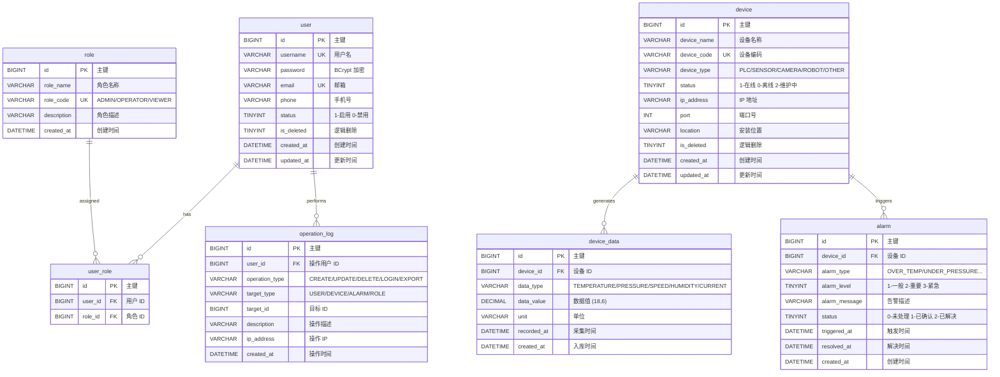

# Industrial AI Hub — 数据库 ER 图

> 数据库：`reboot` | 字符集：utf8mb4 | 引擎：InnoDB

## ER Diagram

## 索引设计

| 表 | 索引 | 类型 | 覆盖查询 |
|----|------|:---:|------|
| `user` | `PRIMARY(id)` | 聚簇 | findById |
| | `uk_username` | 唯一 | findByUsername |
| | `uk_email` | 唯一 | — |
| | `idx_is_deleted` | 普通 | is_deleted=0 |
| `device` | `PRIMARY(id)` | 聚簇 | findById |
| | `uk_device_code` | 唯一 | findByCode |
| | `idx_device_type` | 普通 | findByType |
| | `idx_status` | 普通 | status=? |
| | `idx_is_deleted` | 普通 | is_deleted=0 |
| `device_data` | `PRIMARY(id)` | 聚簇 | — |
| | `idx_device_id` | 普通 | device_id=? |
| | `idx_recorded_at` | 普通 | ORDER BY recorded_at |
| | `idx_device_type_time` | 复合 | device_id+data_type+recorded_at |
| `alarm` | `PRIMARY(id)` | 聚簇 | — |
| | `idx_device_id` | 普通 | device_id=? |
| | `idx_alarm_level` | 普通 | alarm_level=? |
| | `idx_status` | 普通 | status=? |
| | `idx_triggered_at` | 普通 | ORDER BY triggered_at |
| `operation_log` | `PRIMARY(id)` | 聚簇 | — |
| | `idx_user_id` | 普通 | userId=? |
| | `idx_operation_type` | 普通 | — |
| | `idx_created_at` | 普通 | ORDER BY created_at |

## 表规模

| 表 | 列数 | 约束(CHECK) | 索引 |
|----|:---:|:---:|:---:|
| `user` | 9 | 1 (status) | 4 |
| `role` | 5 | 0 | 2 |
| `user_role` | 4 | 0 | 3 |
| `device` | 11 | 2 (status, device_type) | 5 |
| `device_data` | 7 | 1 (data_type) | 4 |
| `alarm` | 9 | 2 (level, status) | 5 |
| `operation_log` | 8 | 2 (operation_type, target_type) | 4 |
| **合计** | **53** | **8** | **27** |
