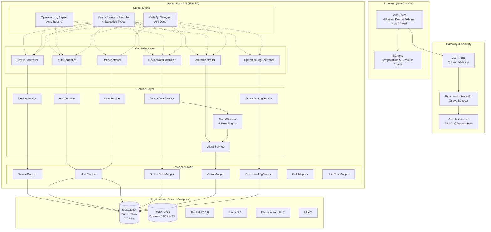
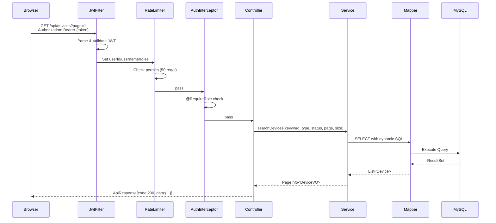

# Industrial AI Hub — 系统架构图

> 版本：v1.0 | 更新：2026-08-02

## 总体架构

## 请求处理链路

## 技术栈分层

| 层 | 技术 | 版本 |
|----|------|------|
| 前端 | Vue 3 + Vite + ECharts | latest |
| 构建 | Maven Wrapper | 3.9.6 |
| 运行时 | JDK (Temurin) | 25 LTS |
| Web 框架 | Spring Boot | 3.5.0 |
| ORM | MyBatis Spring Boot | 3.0.5 |
| 分页 | PageHelper | 2.1.0 |
| 认证 | JJWT | 0.12.6 |
| 加密 | BCrypt (spring-security-crypto) | — |
| 限流 | Guava RateLimiter | 33.4.0 |
| API 文档 | Knife4j | 4.5.0 |
| 测试 | JUnit 5 + Mockito | spring-boot-starter-test |
| 数据库 | MySQL 8.4 (Docker) | — |
| 缓存 | Redis Stack | 7.4.0-v1 |
| 消息 | RabbitMQ | 4.0 |
| 注册 | Nacos | 2.4.3 |
| 搜索 | Elasticsearch | 8.17.0 |
